# MOOC FPO
Une plateforme pédagogique d'enseignement à distance de la Faculté Polydisciplinaire de Ouarzazate.

## Description
Cette plateforme a été créé Afin de permettre à les étudiants de la FPO, de suivre en ligne des activités pédagogiques (cours, TD, TP …..) et d'interagir entre eux ou/et avec leurs enseignants.

### AUTHENTIFICATION

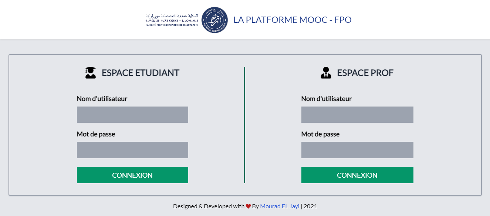

Les Etudiants et les professeurs peuvent se connecter à leur espace d'aprés un formulaire d'authentification.

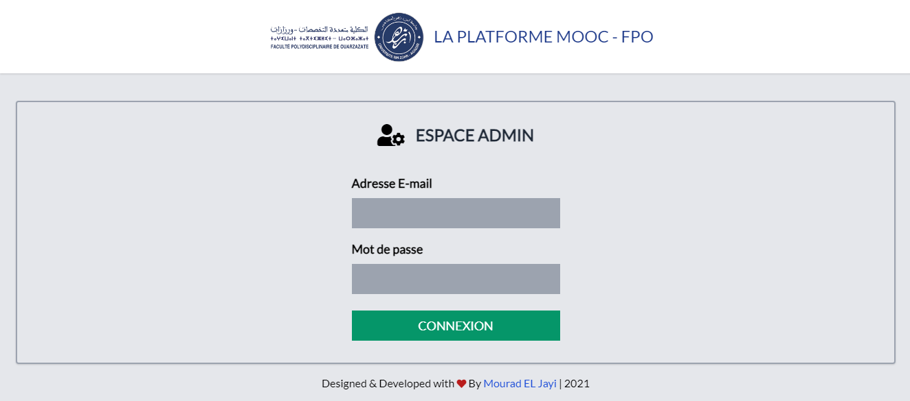

L'administrateur de la platforme a également son espace qui peut s'y connecter en utilisant un autre formulaire d'authentification.

### ESPACE ETUDIANT

Une fois que l'étudiant a réussi à se connecter, il sera redirigé vers son espace qui contient tous les modules de sa filière.

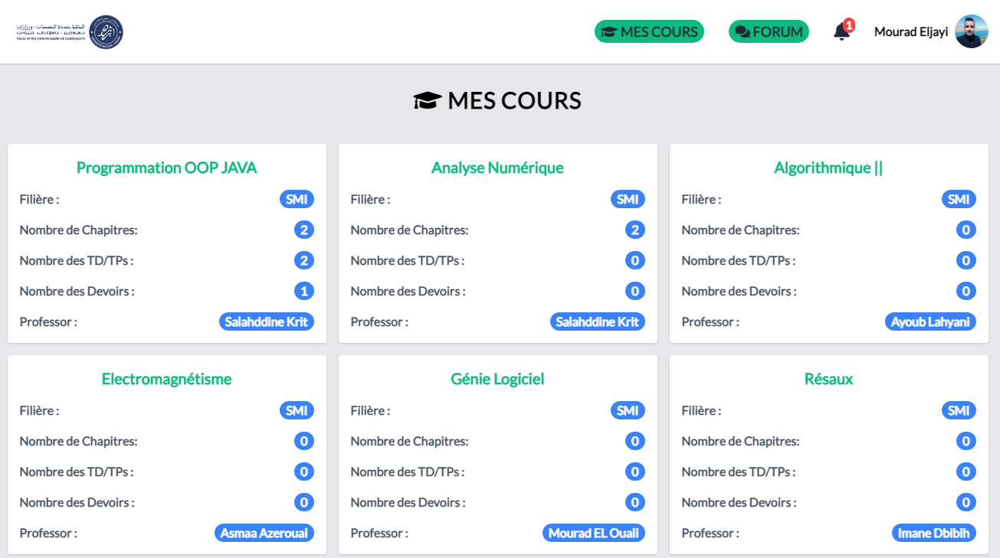

* L'étudiant peut consulter ses cours/TD/TP 
* Envoyer des reponses des devoirs
* participer au forum des disussion (Ajouter ou répondre à les discussions ) et modifier ou supprimer ses propres discussions. 
* Modifier les informations personnelles de son profile
* avoir des notifications si un devoir a été ajouté.

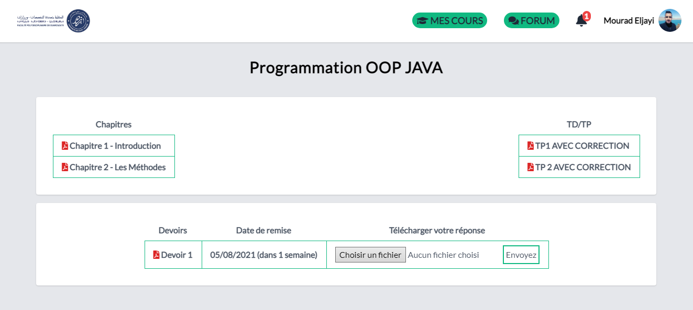
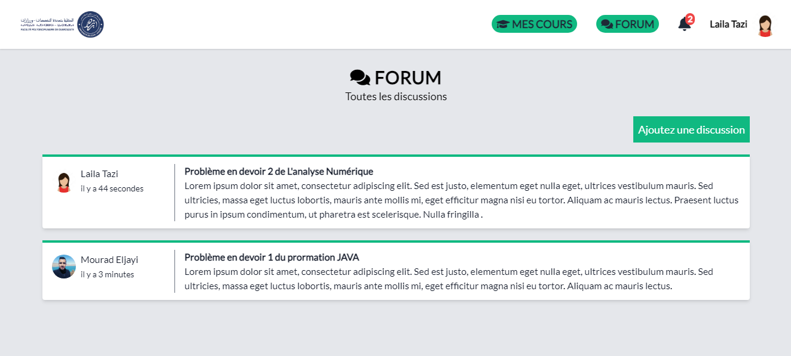
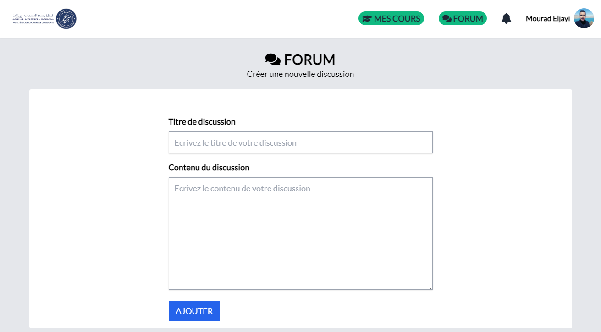
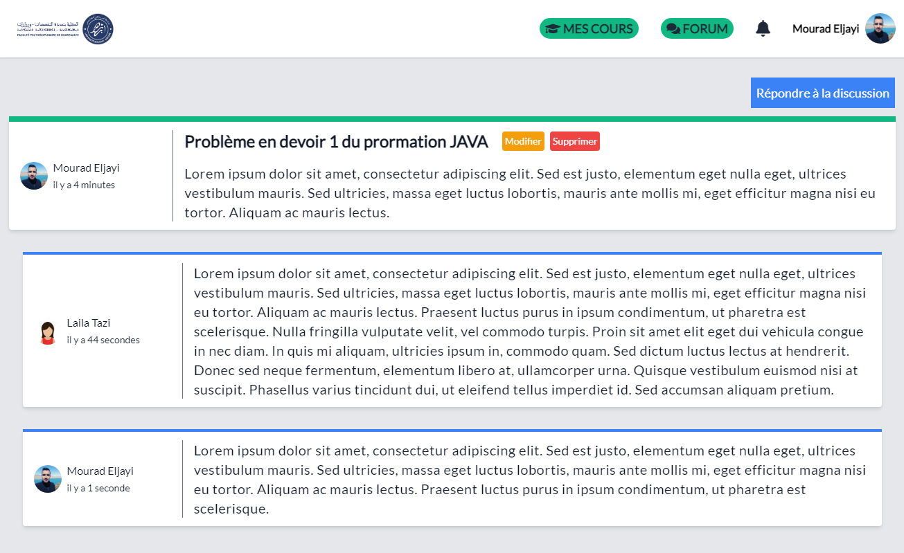

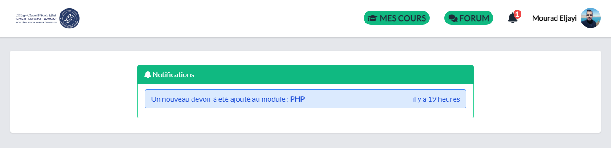

### ESPACE PROFESSEUR

Une fois que le professeur a réussi à se connecter, il sera redirigé vers son espace qui contient tous ses modules dont il est responsable.

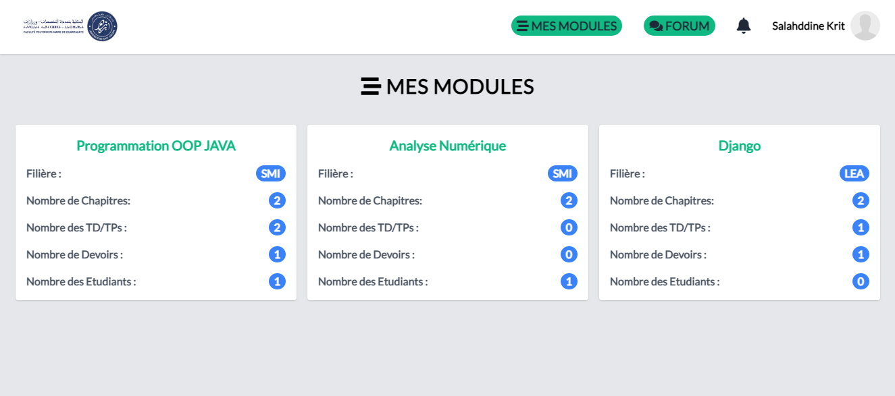

* Le professeur peut consulter ses cours/TD/TP 
* Ajouter / modifier / supprimer des cours/TD/TP
* participer au forum des disussion (Ajouter ou répondre à les discussions ) et modifier ou supprimer ses propres discussions. 
* Modifier les informations personnelles de son profile
* avoir des notifications si une réponse d'un étudiant pour un devoir a été ajoutée.

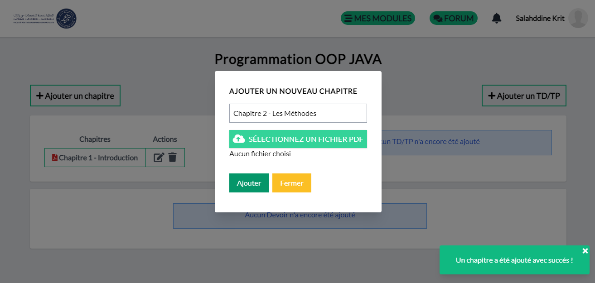

### ESPACE ADMIN

Une fois que l'administrateur a réussi à se connecter, il sera redirigé vers son espace dont il peut gérer les étudiants, les professeurs, les modules et les filières de la plateforme.

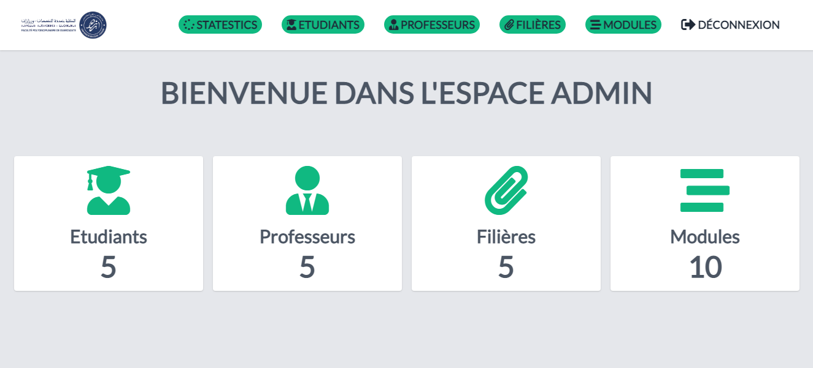

* L'admin peut consulter les étudiants, les professeurs, les modules et les filières  
* Ajouter / Modifier / Supprimer ou rechercher les étudiants, les professeurs, les modules et les filières

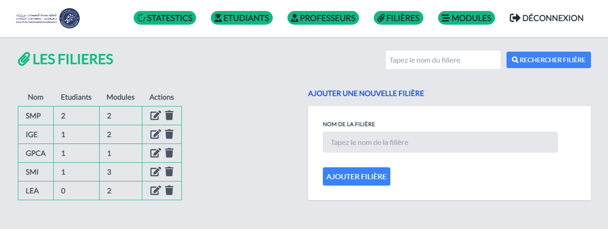
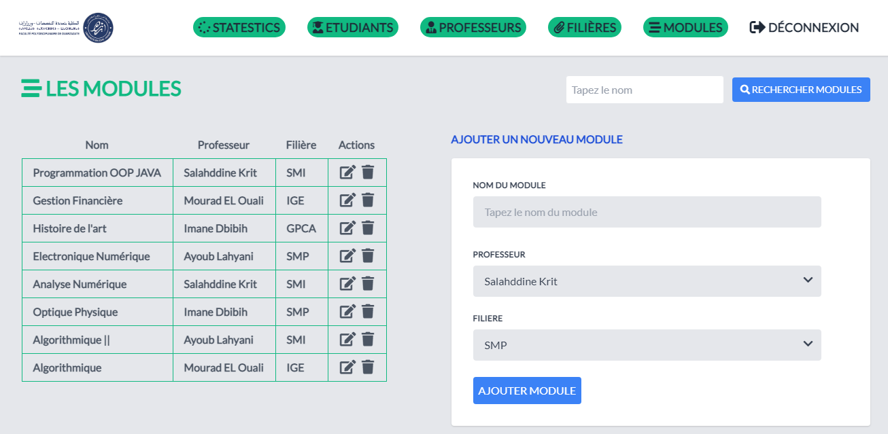

### TECHNOLOGIES UTILISEES

#### [LARAVEL](https://laravel.com)

Laravel est un framework web open-source écrit en PHP respectant le principe modèle-vue-contrôleur et entièrement développé en programmation orientée objet. Laravel est distribué sous licence MIT, avec ses sources hébergées sur GitHub.

#### [TAILWIND CSS](https://tailwindcss.com)

Tailwind CSS est un framework CSS conçu pour les utilitaires pour créer rapidement des interfaces utilisateur personnalisées. J'aime y penser comme un moyen sympa d'écrire un style en ligne et d'obtenir une interface impressionnante sans écrire une seule ligne de votre propre CSS.

#### [ALPINE JS](https://github.com/alpinejs/alpine/blob/master/README.fr.md)

Alpine js est un cadre minimal et robuste pour la composition du comportement Javascript dans votre balisage. C'est vrai, dans votre balisage! Il vous permet d'écrire la plupart de votre JS en ligne dans votre HTML, ce qui facilite l'écriture du code déclaratif (par opposition au code procédural).

### REACTIVITE

L'application MOOC FPO offre également une expérience de lecture et de navigation optimales pour l’utilisateur quelle que soit sa gamme d’appareil (téléphones mobiles, tablettes, liseuses, moniteurs d’ordinateur de bureau)
grâce au fonctionnalités du framework Tailwind CSS.

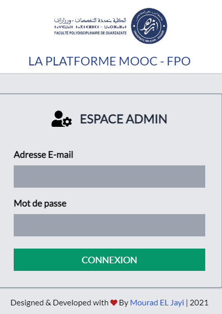

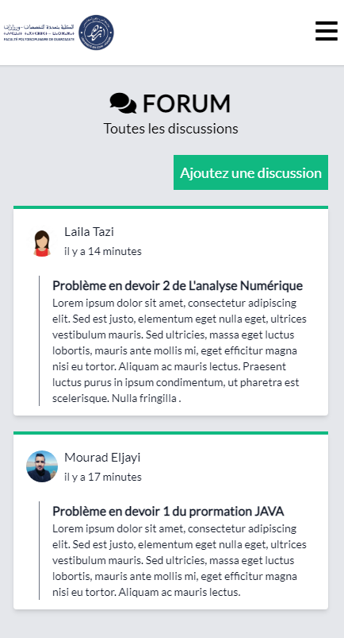

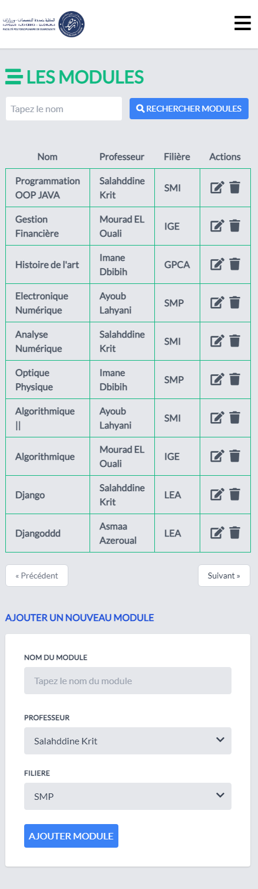

