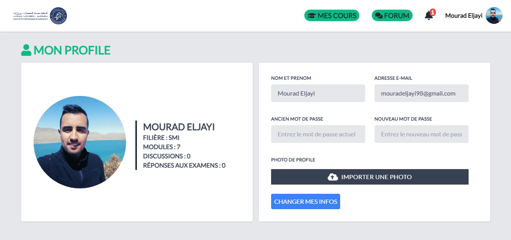

# MOOC FPO
Une plateforme pédagogique d'enseignement à distance de la Faculté Polydisciplinaire de Ouarzazate.

## Description
Cette plateforme a été créé Afin de permettre à les étudiants de la FPO, de suivre en ligne des activités pédagogiques (cours, TD, TP …..) et d'interagir entre eux ou/et avec leurs enseignants.

### AUTHENTIFICATION

Les Etudiants et les professeurs peuvent se connecter à leur espace d'aprés un formulaire d'authentification.

L'administrateur de la platforme a également son espace qui peut s'y connecter en utilisant un autre formulaire d'authentification.

### ESPACE ETUDIANT

Une fois que l'étudiant a réussi à se connecter, il sera redirigé vers son espace qui contient tous les modules de sa filière.

* L'étudiant peut consulter ses cours/TD/TP 
* Envoyer des reponses des devoirs
* participer au forum des disussion (Ajouter ou répondre à les discussions ) et modifier ou supprimer ses propres discussions. 
* Modifier les informations personnelles de son profile
* avoir des notifications si un devoir a été ajouté.

### ESPACE PROFESSEUR

Une fois que le professeur a réussi à se connecter, il sera redirigé vers son espace qui contient tous ses modules dont il est responsable.

* Le professeur peut consulter ses cours/TD/TP 
* Ajouter / modifier / supprimer des cours/TD/TP
* participer au forum des disussion (Ajouter ou répondre à les discussions ) et modifier ou supprimer ses propres discussions. 
* Modifier les informations personnelles de son profile
* avoir des notifications si une réponse d'un étudiant pour un devoir a été ajoutée.

### ESPACE ADMIN

Une fois que l'administrateur a réussi à se connecter, il sera redirigé vers son espace dont il peut gérer les étudiants, les professeurs, les modules et les filières de la plateforme.

* L'admin peut consulter les étudiants, les professeurs, les modules et les filières  
* Ajouter / Modifier / Supprimer les étudiants, les professeurs, les modules et les filières

